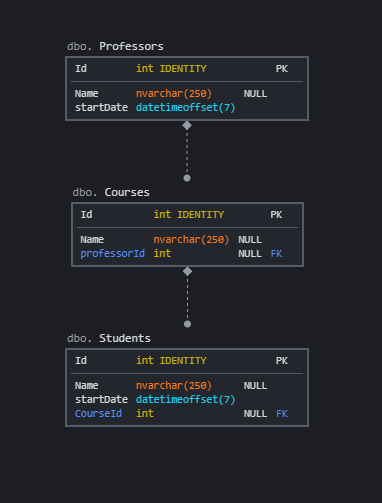

# EntityFramework DbMapping Basics

## Requirements 

For doing this exercise I recommend to you to have Visual Studio (at last 2017), netcore 3 installed and SQL Server Management Studio.

- [Sql Management Studio](https://docs.microsoft.com/es-es/sql/ssms/download-sql-server-management-studio-ssms?view=sql-server-ver15)
- [NetCore 3.1](https://dotnet.microsoft.com/download/dotnet/3.1)
- [Visual Studio 2019](https://visualstudio.microsoft.com/es/vs/)


## Getting our hands dirty

in this exercise we will build some basic DbMapping setup.

We have this three entities:

```csharp
    public class Course
    {
        public int Id { get; set; }
        public string CourseName { get; set; }
        public Professor professor { get; set; }
        public IList<Student> Students { get; set; }
        public bool isComplete => (Students?.Count >= 22);
    }

    public class Student
    {
        public int Id { get; set; }
        public string StudentName { get; set; }
        public DateTimeOffset startDate { get; set; }
        public bool IsSenior => (DateTime.UtcNow.Year - startDate.Year) > 1;

    }

    public class Professor
    {
        public int Id { get; set; }
        public string ProfessorName { get; set; }
        public DateTimeOffset startDate { get; set; }
        public bool IsSenior => (DateTime.UtcNow.Year - startDate.Year) > 1;
    }
```

And we need to persist them in a database with the current model:





What we need to build: 

 - We need to "Ignore" the IsSenior Properties listed in Professor and Student class on the generation of the schema. 
 - We have a database restriction on Entities Names, the column in database must be 250 Characters Max Lenght and has the name "Name".

## On Finished Exercise

you can launch this query and see if everything is working:

```sql
use schooldb

select c.Name as CName, p.Name as PName, s.Name as SName
  FROM [schooldb].[dbo].[Courses] c 
    inner join Professors p on c.professorId = p.Id
	inner join Students s on s.CourseId = c.Id
```

## References

- [DbContext Modeling Fluent API](https://docs.microsoft.com/es-es/ef/core/modeling/)
