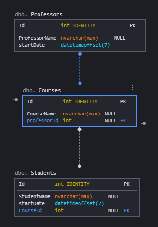

# EntityFramework Scaffolding

in this exercise we will build some basic scaffolding for working with EntityFramework.

We have this three entities:

```csharp
  public class Course
    {
        public int Id { get; set; }
        public string CourseName { get; set; }
        public Professor professor { get; set; }
        public IList<Student> Students { get; set; }
    }

    public class Student
    {
        public int Id { get; set; }
        public string StudentName { get; set; }
        public DateTimeOffset startDate { get; set; }

    }

    public class Professor
    {
        public int Id { get; set; }
        public string ProfessorName { get; set; }
        public DateTimeOffset startDate { get; set; }
    }
```

And we need to persist them in a database with the current model:





What we build: 
 - A valid DbContext with the three Entities that we have.
for doing this exercise we can use a LocalDb ConnectionString you can create this connection hardcoded like this:

```csharp
 var connectionString = @"Data Source=(LocalDb)\MSSQLLocalDB;Initial Catalog=schooldb;Integrated Security=SSPI;";
```

Notice that in 