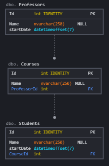

# EntityFramework Relationships & ForeignKeys Basics

## Requirements 

For doing this exercise I recommend to you to have Visual Studio (at last 2017), netcore 3 installed and SQL Server Management Studio.

- [Sql Management Studio](https://docs.microsoft.com/es-es/sql/ssms/download-sql-server-management-studio-ssms?view=sql-server-ver15)
- [NetCore 3.1](https://dotnet.microsoft.com/download/dotnet/3.1)
- [Visual Studio 2019](https://visualstudio.microsoft.com/es/vs/)


## Getting our hands dirty

in this exercise we will build some basic Relationship setup.

We have this three entities:

```csharp
        public class Course
    {
        public int Id { get; set; }
        public string CourseName { get; set; }
        public int ProfessorId { get; set; }
        public Professor professor { get; set; }
        public IList<Student> Students { get; set; }
        public bool isComplete => (Students?.Count >= 22);
    }

    public class Student
    {
        public int Id { get; set; }
        public string StudentName { get; set; }
        public DateTimeOffset startDate { get; set; }
        public bool IsSenior => (DateTime.UtcNow.Year - startDate.Year) > 1;
        public int CourseId { get; set; }
        public Course Course { get; set; }

    }

    public class Professor
    {
        public int Id { get; set; }
        public string ProfessorName { get; set; }
        public DateTimeOffset startDate { get; set; }
        public bool IsSenior => (DateTime.UtcNow.Year - startDate.Year) > 1;
        public IList<Course> Courses { get; set; }
    }
```

And we need to persist them in a database with the current model:





What we need to build: 

 - We need to make the NavigationProperties Working without broking the actual behaviour. 
 

## On Finished Exercise

you can uncomment the lines on program.cs to test if the solution works fine.

```csharp
//UnComment These lines
var professorWithMoreThanOneCourse = myContext.Professors.Include(x => x.Courses).Where(x=> x.Courses.Count>1).ToList();
var projectionResults = professorWithMoreThanOneCourse.Select(x => new { ProfessorName = x.ProfessorName, CourseNames = string.Join(",", x.Courses.Select(y => y.CourseName)) });
Console.WriteLine("");
Console.WriteLine("Results of the queries are:");
string result = projectionResults.DumpAsJson();
Console.WriteLine(result);
```

## References

- [DbContext Relationships Fluent API](https://docs.microsoft.com/es-es/ef/core/modeling/relationships?tabs=fluent-api%2Cfluent-api-simple-key%2Csimple-key)
